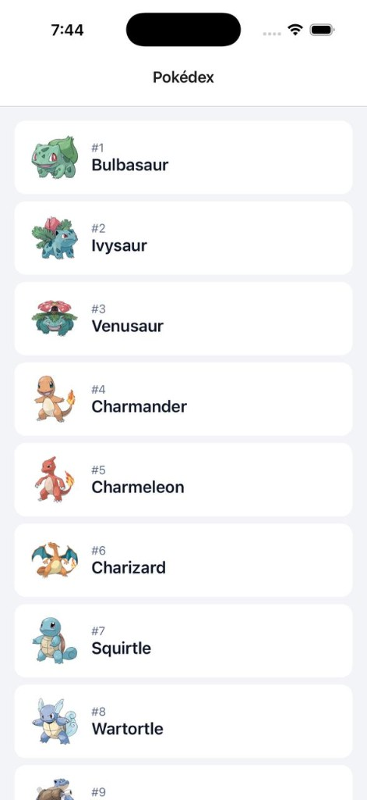
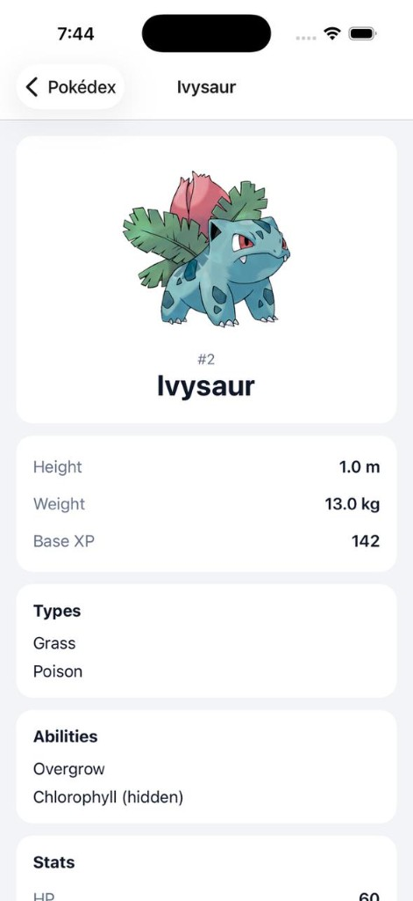
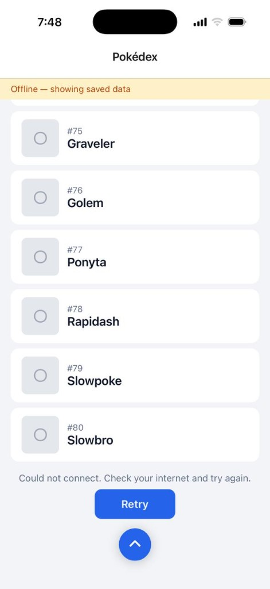
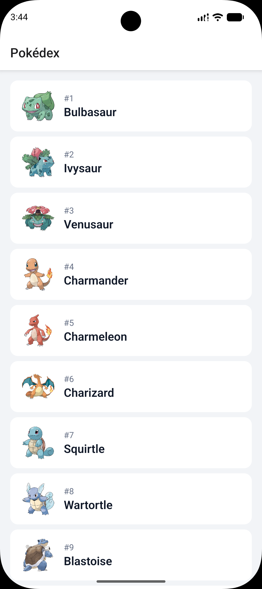
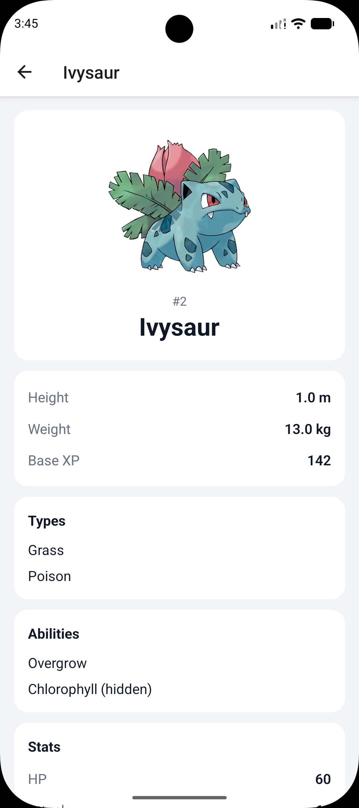
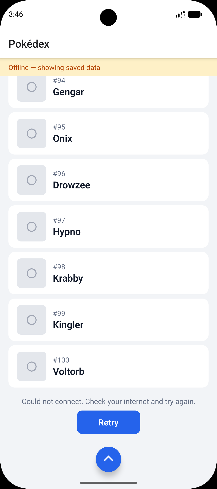
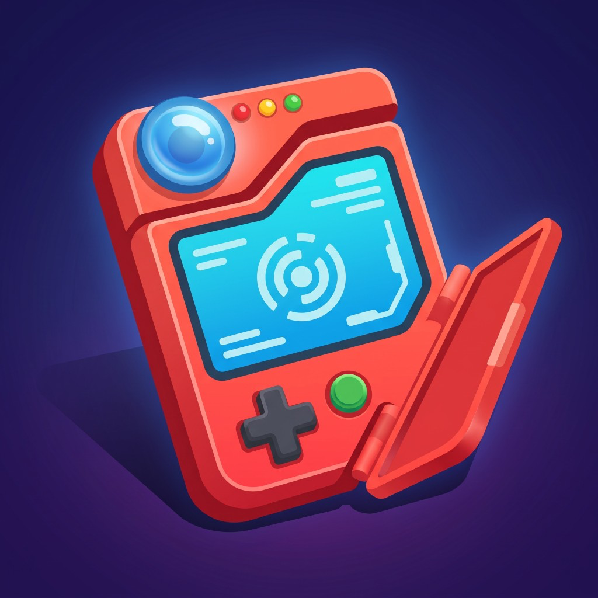

# PokemonApp

Pokédex en React Native CLI 0.87.1. Lista + detalle contra [PokéAPI](https://pokeapi.co/docs/v2), cache en AsyncStorage.

La UI está en inglés. Esto lo escribí en español.

## Correrla

Node 22.11+, Yarn 1.

```bash
yarn install
```

### Android

minSdk 24. `applicationId` `com.pokemonapp`.

```bash
yarn android
```

Si el repo está limpio, rebuild nativo. Metro no es suficiente: hay AsyncStorage y React Navigation.

### iOS

iOS 15.1+. Scheme `PokemonApp`, bundle `com.pokemonapp`, en el home se ve **Pokedex**.

Necesitas Xcode de verdad, no solo Command Line Tools. CocoaPods va con Bundler (el `Gemfile` ya está). Los `Pods/` no van en git; el `Podfile.lock` sí, no lo regeneres al azar.

```bash
bundle install
cd ios && bundle exec pod install && cd ..
yarn ios
```

Eso instala pods, arma `PokemonApp.app` y abre el simulador. Si Metro ya está en 8081, lo reusa.

A mano:

```bash
open ios/PokemonApp.xcworkspace
```

El scheme es `PokemonApp` (Debug). **No** abras el `.xcodeproj`: sin el workspace no ve los pods y se cae el build.

Primera vez Xcode se puede tardar bajando el runtime del simulador. Después `yarn ios` alcanza.

### Checks

```bash
yarn typecheck
yarn lint
yarn test
```

Lo mismo corre en GitHub Actions contra `development` y `main`.

## Capturas

iPhone y Pixel 9a. Lista, detalle y sin red (banner + cache + retry).

iOS:

<p>
  
  
  
</p>

Android:

<p>
  
  
  
</p>

## App

La primera página son 20 Pokémon (`offset=0&limit=20`). Al final del `FlatList` pide la siguiente. No hay paginador 1-2-3: en el teléfono se usa mal, y el assessment admite carga incremental.

El tap manda solo `pokemonId`. El detalle vuelve a cargar tipos, habilidades, stats, altura, peso y experiencia base.

Si la API falla o el `fetch` se queda colgado (8s), intento el cache. Si no hay, error y retry.

Pull to refresh en lista y detalle. En la lista, si ya hay datos y se pierde la red, dejo lo cacheado y un banner. El chevron de abajo te manda al inicio.

## Icono



iOS (AppIcon) y Android (mipmap square + round) salen de `assets/app-icon.png`:

```bash
npx icon-set-creator create ./assets/app-icon.png
```

## Carpetas

```
src/app                  DI y navegación
src/core                 AppError, ViewState
src/features/pokemon
  domain                 entidades, repo, use cases
  data                   DTOs, mapper, fetch, AsyncStorage
  presentation           screens y hooks
```

`domain` no importa React Native. ESLint lo bloquea. Las dependencias se arman en `src/app/dependencies.ts`, sin contenedor.

## Libs

React Navigation (y sus peers: `screens`, `gesture-handler`, `safe-area-context`) porque RN no trae stack. AsyncStorage porque tampoco trae storage.

No metí Axios ni Redux. Con `fetch` y el estado del ViewModel fue suficiente.

## Cache e imágenes

Network first. Keys `pokemon:list:<offset>:<limit>` (`{items, hasMore}`) y `pokemon:detail:<id>`. Si sirvo cache o la última petición falla con datos en pantalla, la UI lo dice.

La lista de PokéAPI viene con `name` y `url`, sin artwork. El id sale de la url y con eso armo el Official Artwork, sin N+1 de detalle.
